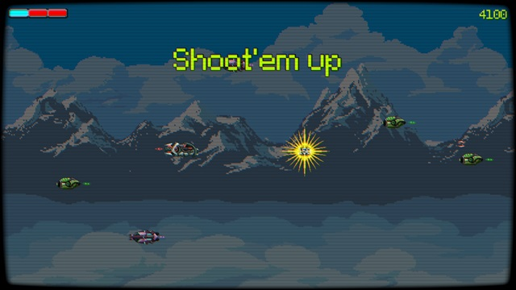

# Shoot 'em up in Godot
[](https://opensource.org/licenses/MIT)
[](https://www.contributor-covenant.org/version/2/0/code_of_conduct/)
[](https://godotengine.org)
[](https://github.com/juan-medina/godot-shootem-up/releases/latest)
[](https://juanmedina.itch.io/godot-shoot-em-up)

<p align="center">
	
</p>

This is just an example of creating a Shoot 'em up in Godot.

You can download the latest release [here](https://github.com/juan-medina/godot-shootem-up/releases/latest) or on [itch.io](https://juanmedina.itch.io/godot-shoot-em-up).

If you need to open a bug or enhancement, please do it [here](https://github.com/juan-medina/godot-shootem-up/issues/new/choose).

## Features

- Player spaceship with movement and shooting.
- Player, enemies will have an energy type.
- To destroy each other the energies need to be different.
- Different enemy spaceships.
- Enemies waves.
- Boss fight.
- CRT effect for retro look.
- Menu with options including:
    - Borderless fullscreen or windowed mode.
    - Music and sound effects volume.
    - CRT effect configuration.
- Game Over window.
- Game Win window.
- High Score.
- Pause and resume game.
- Score and shield bar.
- Sound effects and music.
- Windows, Mac and Linux version.


## Credits

- Game music: [Abstraction - Music Loop Bundle](https://tallbeard.itch.io/music-loop-bundle) by [Abstraction](https://abstractionmusic.com).
    - Menu: Box Jump.
    - Level: Out of Time.
- Background: [Glacial Mountains: Parallax Background](https://vnitti.itch.io/glacial-mountains-parallax-background) by [vnitti](https://vnitti.itch.io/).
- Spaceships: [Free Enemy Spaceship 2D Sprites Pixel Art](https://free-game-assets.itch.io/free-enemy-spaceship-2d-sprites-pixel-art) by [Craftpix](https://craftpix.net/).
- Shield Bar: [UI BARS](https://guilemus.itch.io/ui-bars) by [guilemus](https://guilemus.itch.io/).
- Change energy sound: [Metal00.wav](https://freesound.org/people/jeremysykes/sounds/341254/) by [jeremysykes](https://freesound.org/people/jeremysykes/).
- Player shot fire sound: [laser.wav](https://freesound.org/people/Shaun105/sounds/268168) by [Shaun105](https://freesound.org/people/Shaun105/).
- Enemy Fire sound: [projectile.wav](https://freesound.org/people/jeckkech/sounds/391660/) by [jeckkech](https://freesound.org/people/jeckkech/).
- Shot hit sound: [Hit/Hurt](https://freesound.org/people/Prof.Mudkip/sounds/398957/) by [Prof.Mudkip](https://freesound.org/people/Prof.Mudkip/).
- Ship explosion sound: [8-Bit explosion](https://freesound.org/people/Prof.Mudkip/sounds/386862/) by [Prof.Mudkip](https://freesound.org/people/Prof.Mudkip/).
- Game Over sound: [8-bit Game Over](https://freesound.org/people/Euphrosyyn/sounds/442127/) by [Euphrosyyn](https://freesound.org/people/Euphrosyyn/).
- Game Win sound: [WinSquare.wav](https://freesound.org/people/Fupicat/sounds/527650/) by [Fupicat](https://freesound.org/people/Fupicat/).
- Button press sound: [8-bit 2022 Poke Bright Select Button BBM](https://freesound.org/people/NovaSoundTechnology/sounds/653049/) by [NovaSoundTechnology](https://freesound.org/people/NovaSoundTechnology/).
- Font: [Pixeloid](https://www.fontspace.com/pixeloid-font-f69232) by [GGBotNet](https://www.fontspace.com/ggbotnet).
- CRT effect: [Godot CRT Shader](https://perons.itch.io/godot-crt-shader) by [Perons](https://perons.itch.io/).


## CI
This project includes an Godot [addon](addons/ci_tools/) that deliver several functionalities:

### Build Version: Increase And Launch Main Scene

This will read the game version from the [project.godot](project.godot) file, increase the build version, and then launch the main scene. It default bind to ***CTRL+F5***.

### Update Credits & Features

This will read the [credits.json](resources/credits/credits.json) and [features.json](resources/credits/features.json) and then using to:

 - Update the [README.md](README.md) file with the content of the template [README_template.MD](resources/credits/README_template.MD).
 - Update the [about.bbcode](resources/credits/about.bbcode) file with the content of the [about_template.bbcode](resources/credits/about_template.bbcode) file, this is use in the about menu in the game.
- Update the [itchio.html](resources/credits/itchio.html) file with the content of the [itchio_template.html](resources/credits/itchio_template.html) file, this is use in the itch.io page.

In this way, you can update the credits and features in one place and then update all the files that use it.

### Create Release (Github & itch.io)

This will read the game version from the [project.godot](project.godot) file, and then push a new release to github include the details of the [release_notes.md](release_notes.md) file, this tool requires [Github CLI](https://cli.github.com/) to be installed.

On Github a Windows, Linux, and MacOS builds will be attached to the release and a then release then in itch.io via [this action](.github/workflows/release.yaml)

## LICENSE
```
 Copyright (c) 2024 Juan Antonio Medina Iglesias

 Permission is hereby granted, free of charge, to any person obtaining a copy
 of this software and associated documentation files (the "Software"), to deal
 in the Software without restriction, including without limitation the rights
 to use, copy, modify, merge, publish, distribute, sublicense, and/or sell
 copies of the Software, and to permit persons to whom the Software is
 furnished to do so, subject to the following conditions:

 The above copyright notice and this permission notice shall be included in
 all copies or substantial portions of the Software.

 THE SOFTWARE IS PROVIDED "AS IS", WITHOUT WARRANTY OF ANY KIND, EXPRESS OR
 IMPLIED, INCLUDING BUT NOT LIMITED TO THE WARRANTIES OF MERCHANTABILITY,
 FITNESS FOR A PARTICULAR PURPOSE AND NONINFRINGEMENT. IN NO EVENT SHALL THE
 AUTHORS OR COPYRIGHT HOLDERS BE LIABLE FOR ANY CLAIM, DAMAGES OR OTHER
 LIABILITY, WHETHER IN AN ACTION OF CONTRACT, TORT OR OTHERWISE, ARISING FROM,
 OUT OF OR IN CONNECTION WITH THE SOFTWARE OR THE USE OR OTHER DEALINGS IN
 THE SOFTWARE.
```
